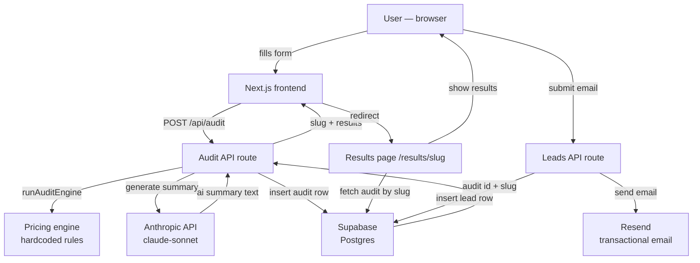

# Architecture

## System diagram

## Data flow

1. User fills the spend input form with tools, plans, seats, team size, use case
2. Frontend POSTs to `/api/audit` with the raw tool inputs
3. Audit API runs the hardcoded pricing engine — pure functions, no AI
4. Audit API calls Anthropic API to generate a personalised 80-100 word summary
5. Audit row is inserted into Supabase with a unique nanoid slug
6. Frontend redirects to `/results/[slug]`
7. Results page fetches the audit from Supabase by slug
8. Results page re-runs the audit engine client-side to get per-tool breakdowns
9. User optionally submits email — stored in leads table, confirmation sent via Resend

## Why this stack

- **Next.js 14 (App Router):** API routes and pages in one repo, no separate backend needed. Server components for SEO on the landing page.
- **TypeScript:** Catches bugs at compile time. The audit engine has complex conditional logic — types make it maintainable.
- **Supabase:** Postgres with a generous free tier. Row-level security disabled for MVP speed; would enable with proper auth in production.
- **Anthropic API:** Used only for the summary paragraph — not for the audit logic itself. Knowing when NOT to use AI is part of good engineering.
- **Resend:** Simple transactional email API with a free tier. Easier than SES for an MVP.
- **Tailwind CSS:** Utility-first — no context switching between CSS files and components.
- **Vercel:** Zero-config deployment for Next.js. Automatic preview URLs for every PR.

## What I would change for 10k audits/day

1. **Cache audit results:** Results page currently re-runs the engine on every load. At scale, cache the per-tool breakdown in the audits table as JSONB.
2. **Rate limiting:** Add Redis-based rate limiting on `/api/audit` — currently only has a honeypot. At 10k/day, abuse becomes a real risk.
3. **Queue the Anthropic call:** Move AI summary generation to a background job (e.g. Inngest or Trigger.dev) so the audit response is instant and the summary loads async.
4. **Enable RLS:** Add proper row-level security policies so users can only access their own audits if we add auth.
5. **CDN for the results page:** Results are mostly static after creation. Cache at the edge with `stale-while-revalidate`.
6. **Separate the pricing engine:** Extract into a standalone package so it can be versioned independently and updated without a full deploy.